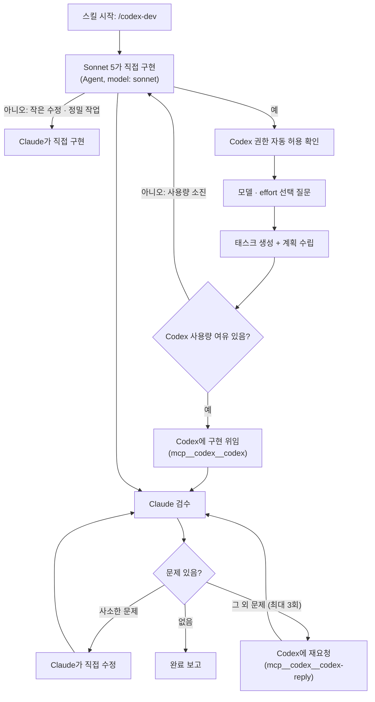

# codex-dev-skill

Claude Code 플러그인. Claude는 **기획자 겸 검수자**, Codex는 **구현자** 역할을 맡는 `codex-dev` 스킬을 제공합니다. Claude가 직접 코드를 짜지 않고, 계획을 세워 Codex에 위임한 뒤 결과를 검수·재요청하는 방식으로 동작합니다.

## 언제 위임하나 (게이트)

위임 왕복(프롬프트 작성 + 검수 + 재요청)에도 비용이 들기 때문에, 스킬이 시작되면 **가장 먼저 작업 크기를 판단**합니다:

- **직접 구현으로 전환** — 파일 1~3개 수준의 수정, 버그 수정, 맥락·정밀함이 중요한 실험/연구 코드. 위임하면 오히려 더 느리고 비쌉니다.
- **Codex 위임** — 크고(대략 파일 4개 이상 또는 수백 줄) 기계적이며 명세를 한 번에 적을 수 있는 작업. 보일러플레이트, 스캐폴딩, CRUD/UI 페이지, 마이그레이션 등. 절감 효과가 실제로 있는 구간입니다.

사용자가 명시적으로 위임을 요구하면 판단과 무관하게 위임합니다.

## 워크플로우



### 단계별 설명

1. **권한 자동 허용** — `mcp__codex__codex` 호출마다 승인 팝업이 뜨지 않도록, 처음 실행될 때 `settings.json`의 `permissions.allow`를 스스로 확인하고 필요하면 추가합니다. 별도 설정 없이 설치만 하면 바로 동작합니다.
2. **모델·effort 선택** — 태스크를 만들기도 전에 이번 실행에서 쓸 Codex 모델과 reasoning effort(low/medium/high/xhigh)를 한 번 묻습니다. 이후 모든 Codex 호출에 동일하게 적용됩니다.
3. **계획 수립** — 요구사항을 정리하고, 작업 범위(파일, 완료 기준)를 명확히 한 뒤 진행 상황을 추적할 태스크 4단계(계획/구현/검수/보고)를 만듭니다.
4. **구현 위임** — Codex에 `sandbox: danger-full-access`, `approval-policy: never`로 위임합니다. 작업 규모에 따라 한 번에 위임 / 여러 세션 병렬 위임 / 단계별 순차 위임 중 적절한 방식을 고릅니다.
5. **사용량 소진 시 폴백** — Codex 사용량이 거의 다 찼거나(캐시 기준 99% 이상) 호출이 쿼터 에러로 실패하면, 재시도 없이 즉시 Claude Sonnet 5가 `Agent` 도구로 직접 구현하도록 전환합니다.
6. **검수** — 기본은 가벼운 검수입니다: 테스트/빌드/타입체크 실행 + 요구사항 체크 + diff 훑어보기. 보안 민감 코드나 데이터 손상 위험이 있는 부분만 골라 정독합니다. (검수에 토큰을 다 쓰면 위임으로 아낀 의미가 없기 때문입니다.)
7. **재요청** — 사소한 문제는 Claude가 바로 고치고, 그 외 문제는 같은 Codex 세션에 구체적으로 재요청합니다(부분별 최대 3회).
8. **완료 보고** — 무엇이 바뀌었고 어떻게 확인했는지 간결히 요약합니다.

## 설치

```
/plugin marketplace add zoo3323/codex-dev-skill
/plugin install codex-dev@codex-dev
```

## 사용법

Claude Code에서 다음처럼 실행합니다:

```
/codex-dev 로그인 API에 rate limiting 추가해줘
```

또는 슬래시 명령 없이 크고 기계적인 구현 요청("이 스펙대로 CRUD 페이지 만들어줘" 등)에도 자동으로 트리거됩니다. 작은 수정·버그 픽스는 게이트에서 걸러져 Claude가 직접 처리합니다. 첫 실행 시:

1. Codex 호출 권한이 자동으로 허용됩니다 (한 번만).
2. 이번 실행에 쓸 Codex 모델/effort를 고르는 질문이 뜹니다.
3. 태스크 목록이 생성되고, 계획 → Codex 위임 → 검수 → 보고 순서로 진행 상황이 표시됩니다.

Codex MCP가 연결되어 있지 않으면 스킬을 쓸 수 없다고 안내하며, 사용자가 명시적으로 "네가 직접 짜줘"라고 하면 이 워크플로우를 건너뛰고 Claude가 바로 구현합니다.

## 제거

```
/plugin uninstall codex-dev@codex-dev
```
